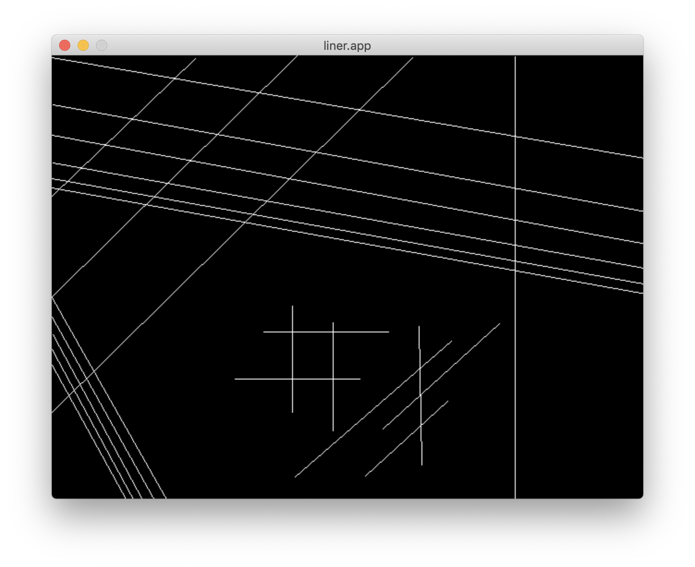

# libmgx
Minimalistic graphic library written on top of minilibX (and others)

### Compiling
Type ```make``` in terminal to get ```libmgx.a```

### Demo
If you want to see some code examples take a look at ```demo``` folder.

Now there is only one example now but number of examples will be increased later.

To compile __"Liner"__ demo type ```make liner.app```

Screenshot:
